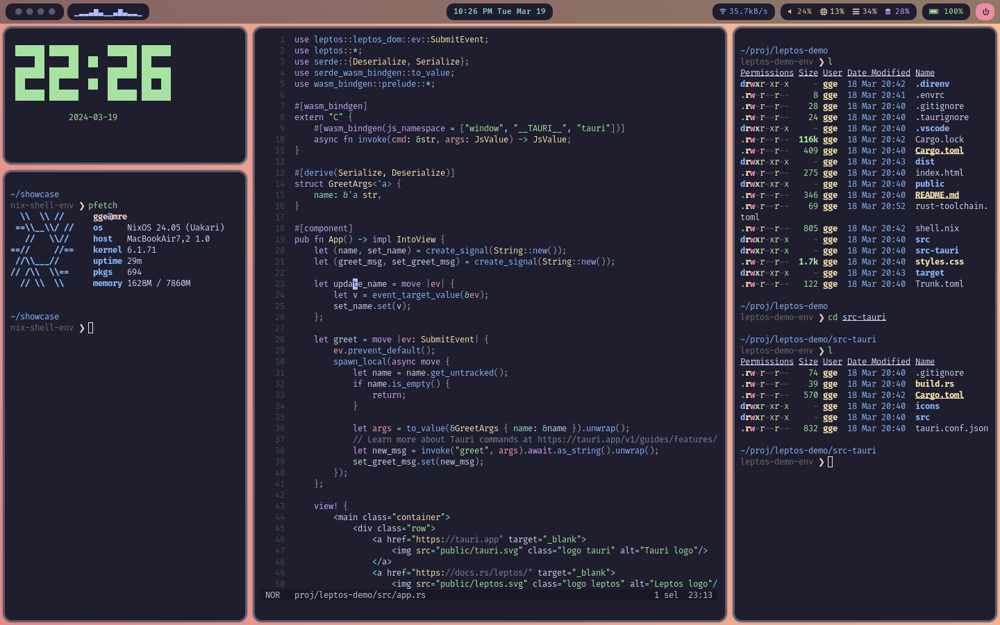
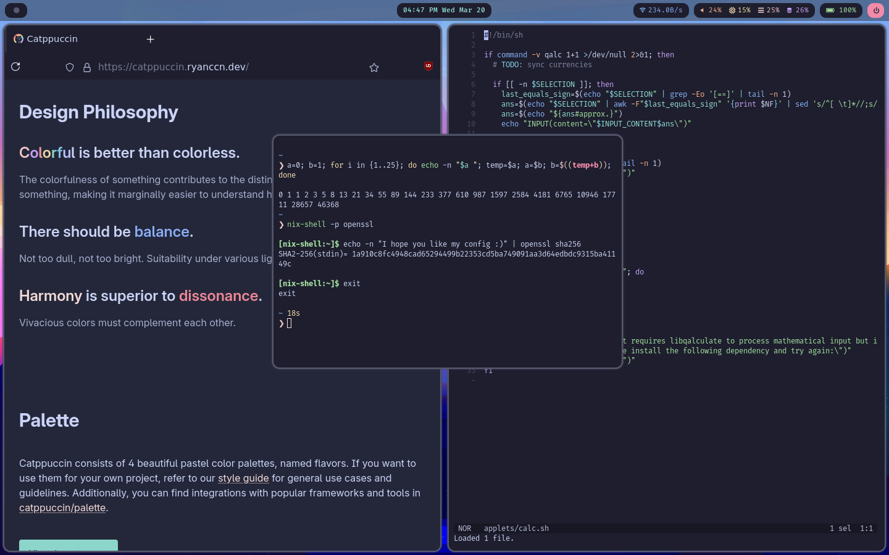

# 🚀 My NixOS Configuration File
**ONE FILE TO RULE THEM ALL**

## Justification

[NixOS](https://nixos.org/) was introduced to me as a linux distribution in which EVERY part of your system can be configured from a single text-based configuration file.
Of course, nobody does this, because you would likely wind up with a huge and messy file of thousands of lines, (I can confirm this). Maintaining such a file is a lot harder than having separate parts of your system managed by encapsulated `nix` files.
I managed my new NixOS system in a framework-like solution via [Nix Flakes](https://nixos.wiki/wiki/Flakes), but I grew restless, yearning for one massive `nix` file to manage my entire computer. 
Ultimately, I combined everything into this single, monstrous file, and it is the unified point of configuration from which every program, system setting, hardware configuration, and environment is set, managed, and maintained for my computer.
In short, don't misconstrue this repo as my ignorance to encapsulation.

**tldr;** I created this because I _could_, not necessarily because I _should_.

## Overview

First of all, to explain what NixOS is, here are a couple of random comments from [DistroWatch](https://distrowatch.com/table.php?distribution=nixos):

One NixOS user writes:

> If "purely functional" is meaningful to you, then this is clearly the right choice.
>
> Even if it doesn't, this could be a great distribution. There are no "what do I have installed" or "why are all the config files in different formats" or "how did I do that" questions. Your entire system configuration is defined in a single place and you simply tell your OS to work the way you specified. Gone are the days where you need to remember the format of a dozen different configuration files. Gone are the days when you don't know exactly how your computer is configured. Gone are the days when you can't get your computer reconfigured exactly how you had it before.
>
> It's amazing.

Another comments:

> Spanning a tech career over 22 years using macOS to Gentoo I am thrilled to be using NixOS and its's capabilities on all my devices and in all respects I possibly can. It's a distro, it's a package manager, it's a language. I don't even want to compare it to other linux distros because it is simply in a class of its own (not to diminish other OSes and PMs). I am now learning something new every day, taking notes and to reiterate excited about this amazing technology and interested in how the future of compute and human / computer interaction could be changed as this project progresses. Purely Functional.

With that in mind, here is why NixOS is my operating system of choice:
1. I control my computer, not the other way around.
  * Everything is customizable, down to the most granular details of every little program and system setting. (Sure Linux already is quite customizable, but NixOS is in a league of its own).
  * I configure these settings with a programming language, [nix](https://nixos.org/manual/nix/unstable/language/index.html). As a programmer, this is powerful. You can use variables, control flow structures, and more in your settings files.
  * Everything is controlled from the same place, I am not forced on the humiliating journey of digging through dotfiles and hidden directories to find a specific config file.
  * Installed packages can be [hacked](https://nixos.org/manual/nixpkgs/stable/#chap-overrides) to your liking, my favorite feature from Gentoo.
2. My system is immutable, atomic, and containerized.
  * I broke my Arch Linux installs occasionally by clumsily managing system files. This is impossible in NixOS where system files are immutable.
  * If a new configuration is not up to par for whatever reason, you can atomically rollback to a previous iteration.
  * Programs are installed with all of their dependencies wrapped together, isolated from one another. Never again will you suffer from [dependency hell](https://en.wikipedia.org/wiki/Dependency_hell).
  * All of these factors contribute to a highly secure system that allows me to rest easy at night.
3. Configuration and package management are declarative and functional.
  * Each time I boot up my system, I know what will be installed on it, (it's all listed in the config file). This avoids accidental bloat and keeps you system-aware.
  * If I want to try a new program without installing it on my machine, I can use `nix-shell -p`. This is such a handy feature to test out applications or accomplish a one-time task with a program I'll never need again.

## Demo Videos

